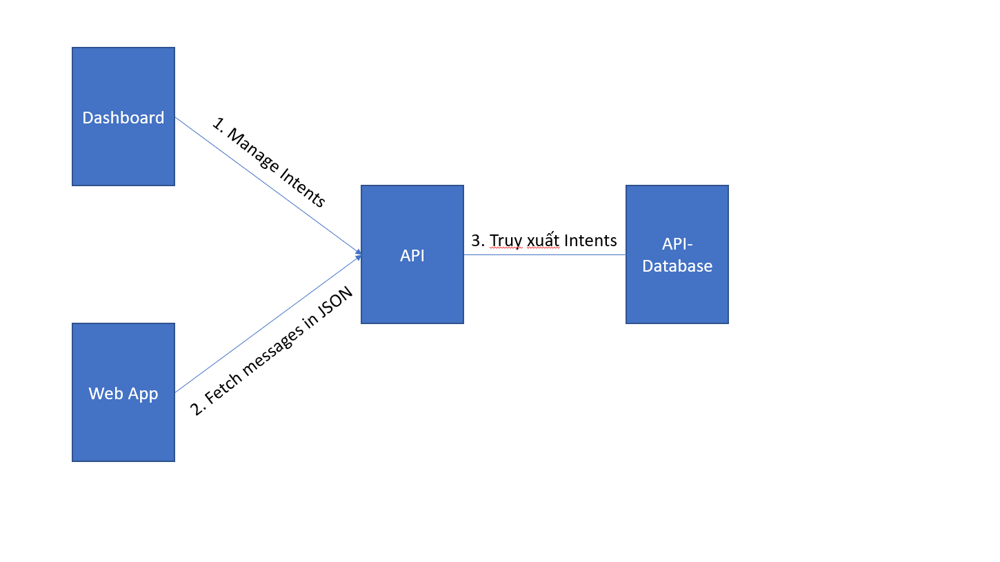
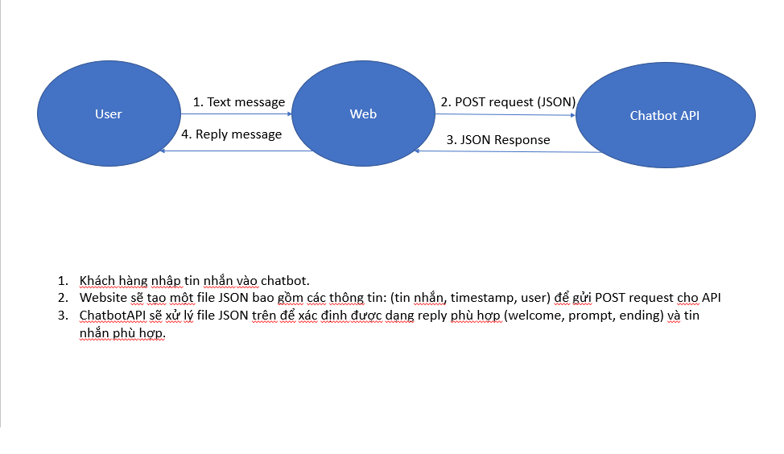
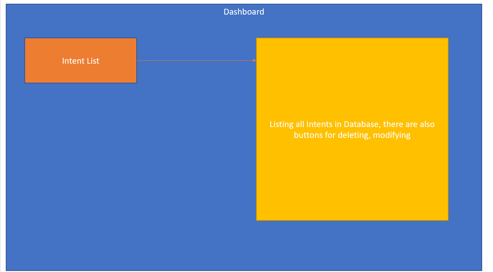
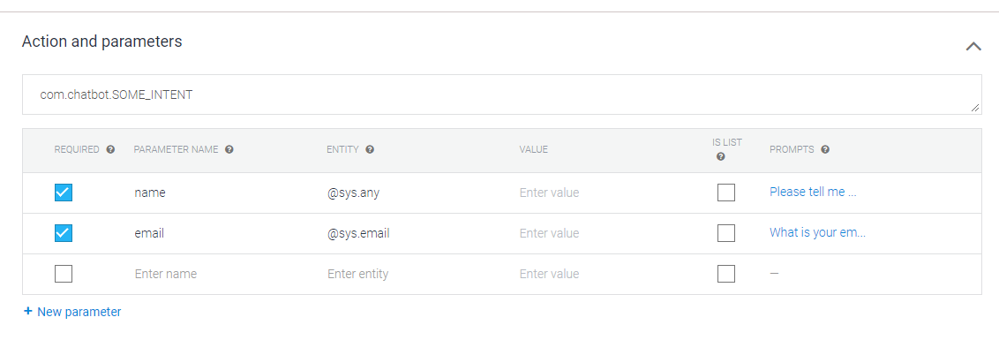

# Chatbot API(GoLang)
## **1. Application Architecture**

## **2. From Web App to API**
### **2.1 Inputs from Web App**
A POST request that has the content of a JSON file describing the fields of inputs.  
Example:
```JSON
{
    "text": "hi",
    "fromUser": "linh"
}
```
### **2.2 Outputs from API**  
A JSON response from the API specifying the the reply from the bot..  
Example:
```JSON
{
    "reply": "Hi! How are you doing?",
    "action": output.Welcome,
    "toUser": "Linh",
    "timeStamp": time,
}
```
### **2.3.Dataflow**

<!-- ### **4.1 Instance of a chatbot worker**
**What is a chatbot worker?**  
A chatbot worker is an instance that has multiple **Intent**.  
**Why does this instance exist?**  
Since multiple web applications will invoke this API, its best that their back-end can create their own instance of the chatbot. -->
### **3 From Dashboard to API**
### **Dashboard layout**

### **Create Intent layout**

### **Intent list layout**

### **Actions and parameters example**

**What is an Intent?**  
An intent is a mechanics that the API uses to detect what to reply.  
**What does an Intent have?**  
- ***IntentName***: Name of the Intent  
- ***IntentTrainingPhrases***: Phrases that the end-point user might use 
- ***Actions and paramters (optional)***: This is used to prompt users to input parameters 
- ***Responses***: An array of messages of what to reply or of prompts  
### **3.2a Creating an Intent**
From dashboard, we can initiate an instance of **Intent** for the API to save it on database.
### **3.2b Modifying an Intent**
Allowing web owners to modify the intents on the database to their needs
### **3.2c Deleting an Intent**
Self-explanatory